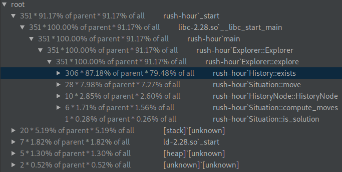
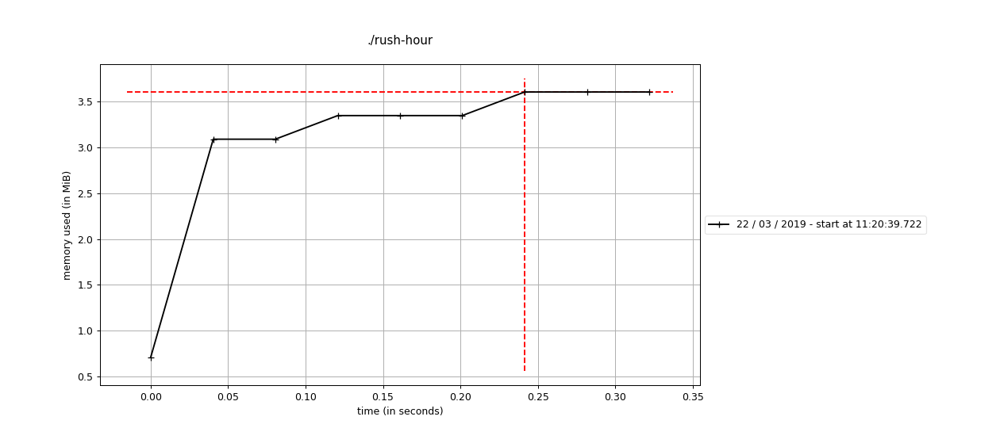
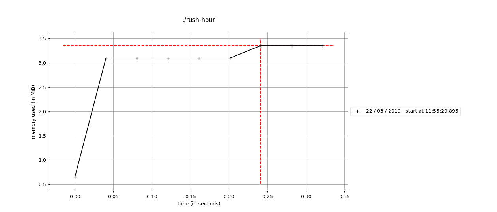

# Rush Hour

Par Guillaume Ortega et Edouard Menayde.

## Performance analysis and memory usage

Using `perf` we can analyse the performance of our program for a given situation to solve.

Using `mprof` (provided by package [http://jmdana.github.io/memprof/](http://jmdana.github.io/memprof/)) we can 
measure memory usage overtime.

### v1

We can see `History:exists` is the function were our program spends most of the time.

## V2

After removing the vector moves of `Situation` to provide it just when needed in the `Explorer` via a return and 
using `unsgined char` instead of `int` or `unsigned int` in data `structs` and `class` where possible we saved some 
memory and do not exceed 3.5MiB as we previously did.