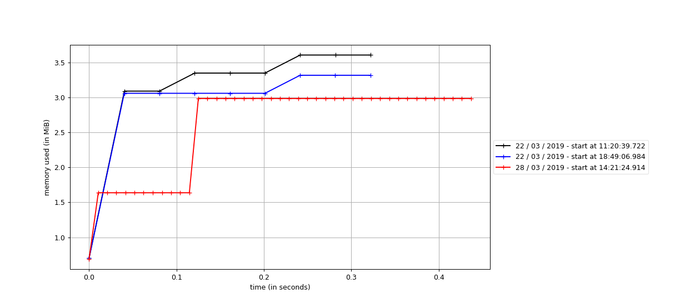

# Rush Hour

Par Guillaume Ortega et Edouard Menayde.

## Performance analysis and memory usage

Using `perf` we can analyse the performance of our program for a given situation to solve.

Using `mprof` (provided by package [http://jmdana.github.io/memprof/](http://jmdana.github.io/memprof/)) we can 
measure memory usage overtime.

### v1


We can see `History:exists` is the function were our program spends most of the time.


## V2


After removing the vector moves of `Situation` to provide it just when needed in the `Explorer` via a return memory 
and use `short` instead of `int` and do not exceed 3.5MiB as we previously did.



## Bugs

### Bad move computing

Bad checks for car movement on the edge of the puzzle which resulted in buggy moves.

## Bad move computing 2 and SIGSEV

We had a 2D array of int8_t contiguous to a vector in memory.
We used the bracket syntax to write to our 2D array like that :
```cpp
parking[i][j] = 0
```
Unfortunately this syntax does not do bound checking and our `get_moves` function generated illegal moves which 
resulted in writing to the vector memory directly when wanting to write to the 2D array. This write resulted in the 
`size` operator of the vector to return big integers which made our loop looping over the vector continuously looping
 until it hit a memory violation.

The fix was to use the `.at()` syntax over the bracket syntax. Using that syntax in the `get_moves` function led 
directly to the bug creating the bad moves in the first place.
