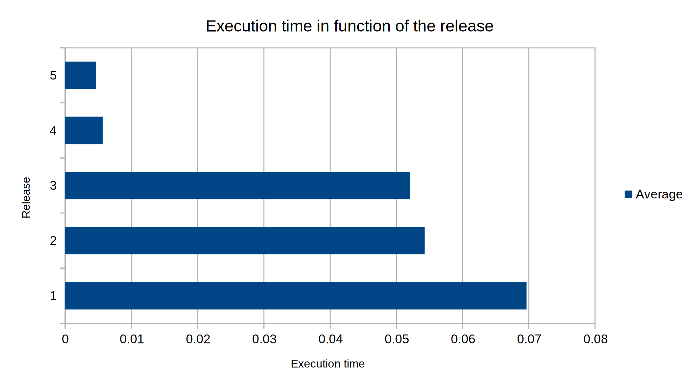
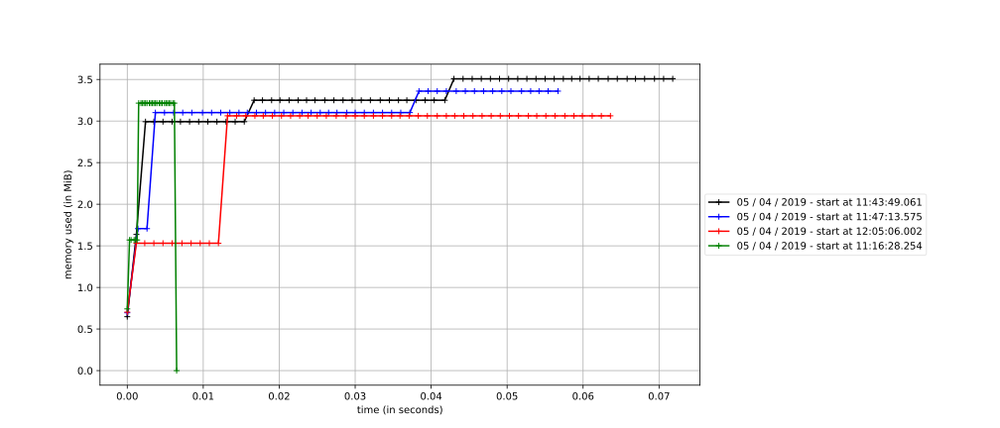
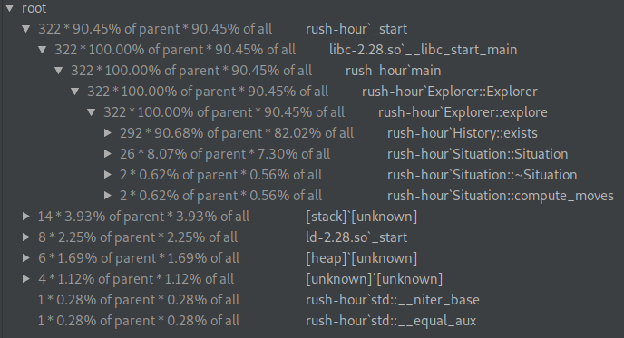

# Rush Hour

Par Guillaume Ortega et Edouard Menayde.

## Performance analysis and memory usage

Using `perf` we can analyse the performance of our program for a given situation to solve.

Using `mprof` (provided by package [http://jmdana.github.io/memprof/](http://jmdana.github.io/memprof/)) we can measure memory usage overtime.







## Changelog


### v0.1
We can see `History:exists` is the function were our program spends most of the time.

### v0.2
*Memory improvement* : Moved out the `vector of possible moves` from the situation to only computing it and returning 
it when needed.
*Bug fix* : Bad checks for car movement on the edge of the puzzle which resulted in buggy moves.

### v0.3
*Memory improvement* : Switching all ints / shorts to int8_t.

*Bug fix* : Bad move computing results in SIGSEV

We had a 2D array of int8_t contiguous to a vector in memory.
We used the bracket syntax to write to our 2D array like that :
```cpp
parking[i][j] = 0
```
Unfortunately this syntax does not do bound checking and our `get_moves` function generated illegal moves which 
resulted in writing to the vector memory directly when wanting to write to the 2D array. This write resulted in the 
`size` operator of the vector to return big integers which made our loop looping over the vector continuously looping
 until it hit a memory violation.

The fix was to use the `.at()` syntax over the bracket syntax. Using that syntax in the `get_moves` function led 
directly to the bug creating the bad moves in the first place.

### v0.4
*Perf improvement* : This graph shows the increase in memory use after switching to a map to store the situations.
